# Homework4

## job1

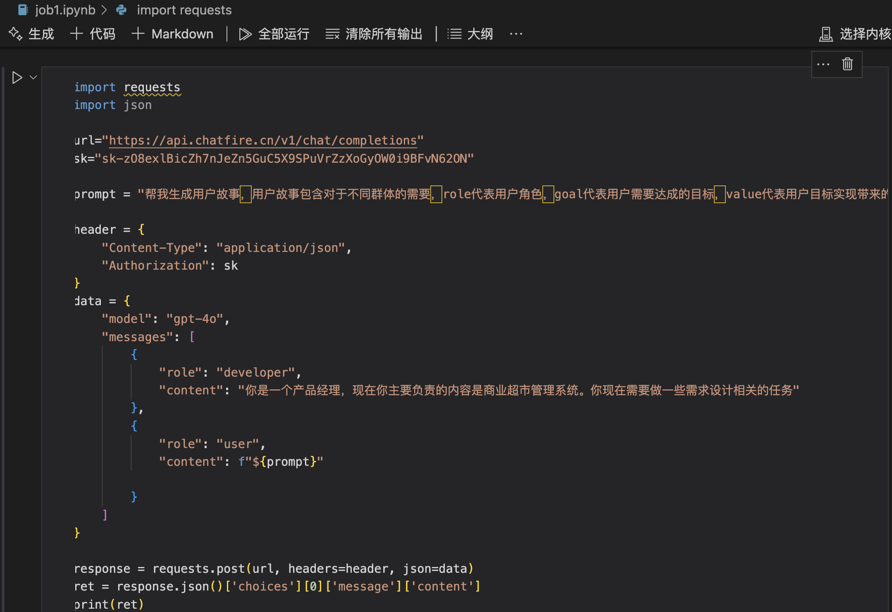

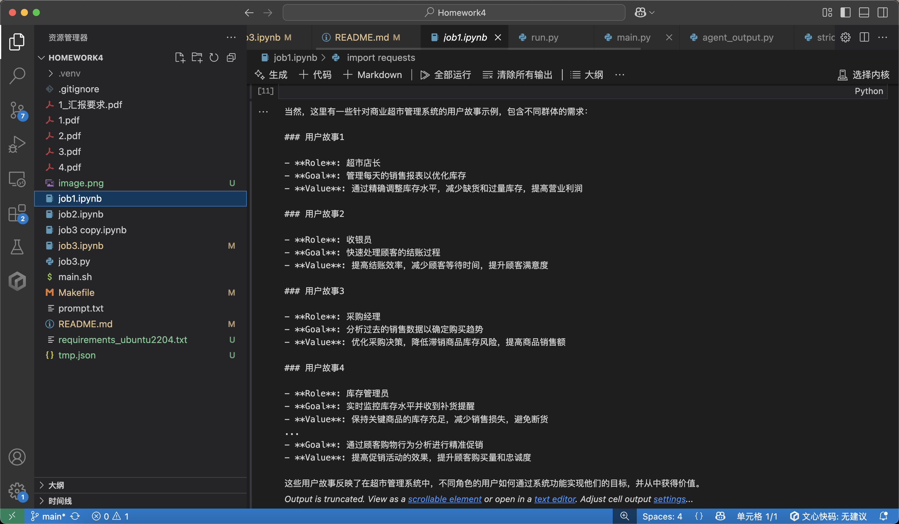

## job2

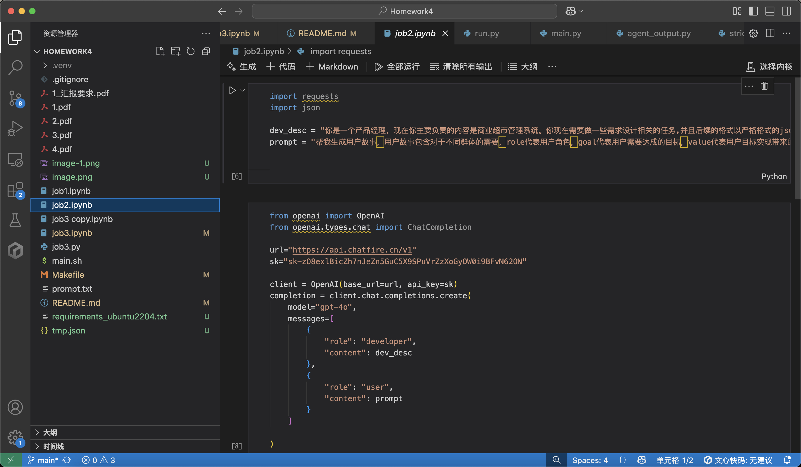

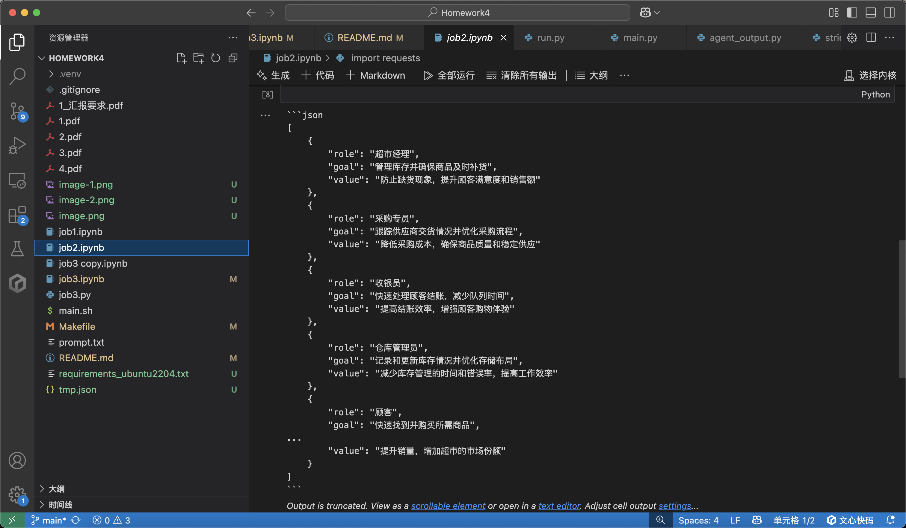

## job3
### 完整的生成json


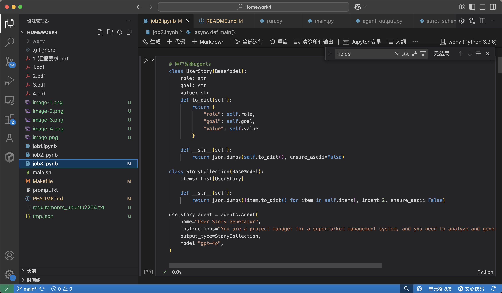

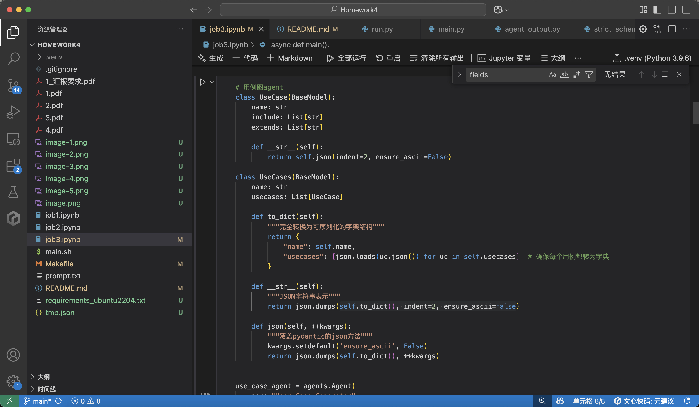

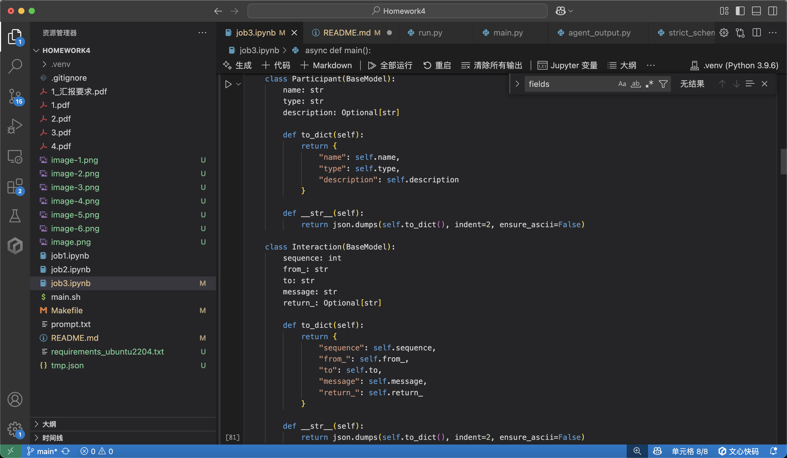

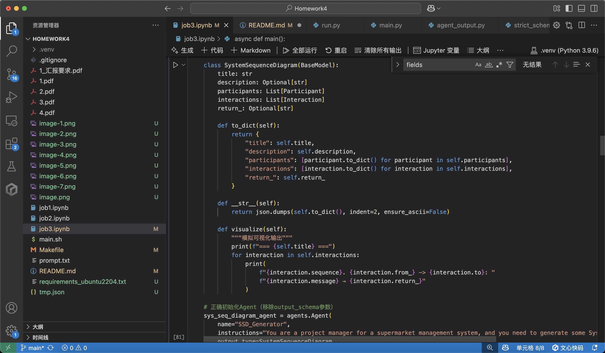

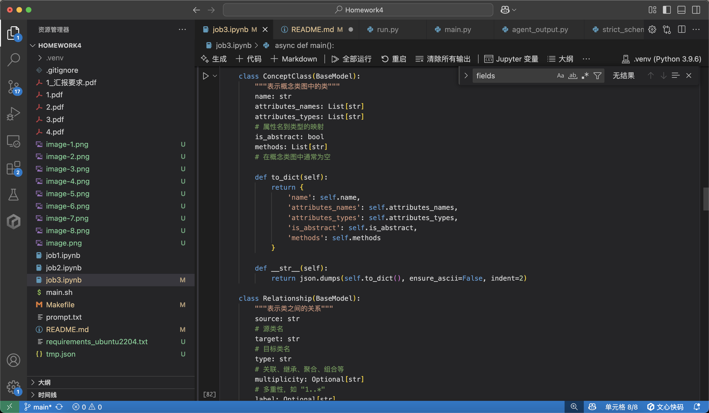

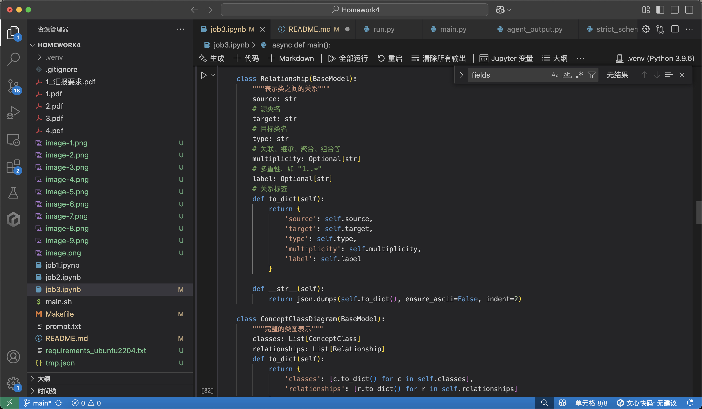

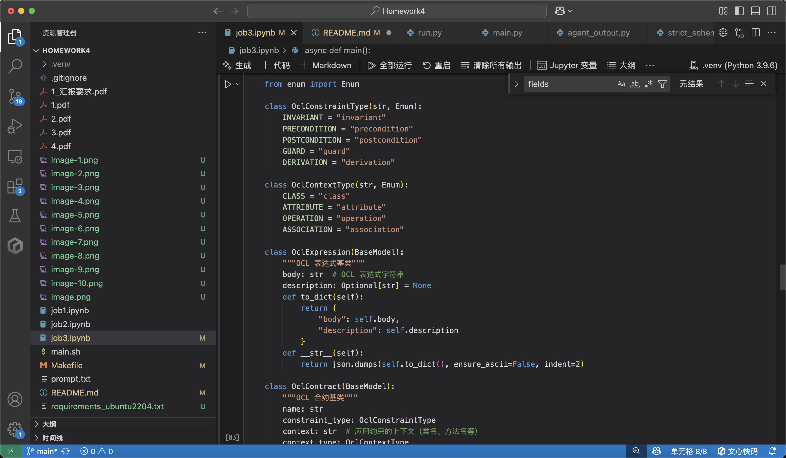

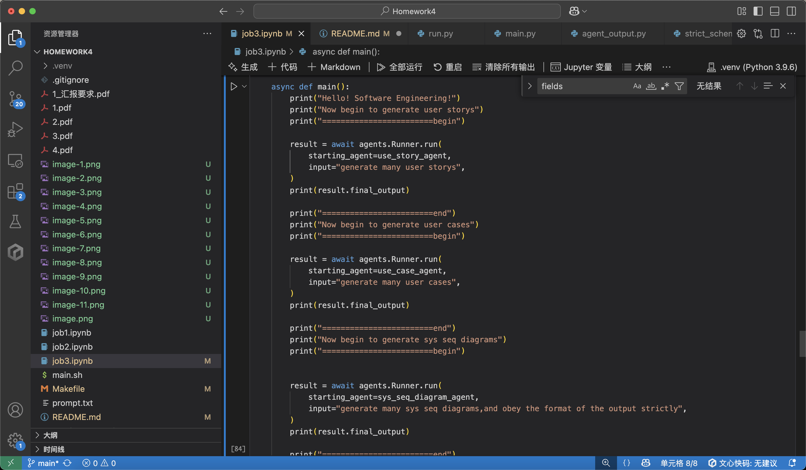

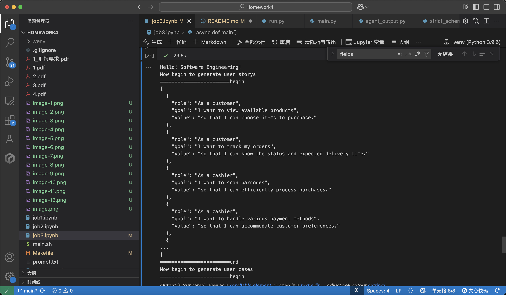
```json
{
  "name": "Supermarket Management System",
  "usecases": [
    {
      "name": "Add New Product",
      "include": [
        "Verify Product Details",
        "Update Inventory"
      ],
      "extends": []
    },
    {
      "name": "Process Checkout",
      "include": [
        "Scan Items",
        "Calculate Total",
        "Process Payment"
      ],
      "extends": []
    },
    {
      "name": "Manage Inventory",
      "include": [
        "Receive Stock",
        "Check Stock Levels"
      ],
      "extends": []
    },
    {
      "name": "Generate Sales Report",
      "include": [
        "Select Date Range",
        "Compile Sales Data"
      ],
      "extends": []
    },
    {
      "name": "Customer Loyalty Program",
      "include": [
        "Enroll Customer",
        "Track Purchases"
      ],
      "extends": [
        "Process Checkout"
      ]
    },
    {
      "name": "Employee Shift Management",
      "include": [
        "Schedule Shift",
        "Notify Employee"
      ],
      "extends": []
    },
    {
      "name": "Online Order Management",
      "include": [
        "Receive Order",
        "Pack Order",
        "Arrange Delivery"
      ],
      "extends": [
        "Process Checkout"
      ]
    },
    {
      "name": "Manage Promotions",
      "include": [
        "Create Promotion",
        "Apply Discount"
      ],
      "extends": [
        "Add New Product"
      ]
    },
    {
      "name": "Customer Feedback Collection",
      "include": [
        "Gather Feedback",
        "Analyze Feedback"
      ],
      "extends": []
    },
    {
      "name": "Supplier Management",
      "include": [
        "Add New Supplier",
        "Track Supplier Deliveries"
      ],
      "extends": []
    }
  ]
}
========================end
Now begin to generate sys seq diagrams
========================begin
{
  "title": "Payment Processing Failure Sequence",
  "description": "Handles failure during payment processing.",
  "participants": [
    {
      "name": "Customer",
      "type": "Actor",
      "description": "Person attempting to pay."
    },
    {
      "name": "Checkout System",
      "type": "System",
      "description": "Processes transactions."
    },
    {
      "name": "Payment Gateway",
      "type": "External System",
      "description": "Payment service."
    }
  ],
  "interactions": [
    {
      "sequence": 1,
      "from_": "Customer",
      "to": "Checkout System",
      "message": "Attempt Payment",
      "return_": null
    },
    {
      "sequence": 2,
      "from_": "Checkout System",
      "to": "Payment Gateway",
      "message": "Process Payment",
      "return_": "Payment Error"
    },
    {
      "sequence": 3,
      "from_": "Payment Gateway",
      "to": "Checkout System",
      "message": "Notify of Error",
      "return_": "Error Details"
    },
    {
      "sequence": 4,
      "from_": "Checkout System",
      "to": "Customer",
      "message": "Display Error Message",
      "return_": "Alternative Options Presented"
    }
  ],
  "return_": null
}
========================end
Now begin to generate concept class diagram
========================begin
{
  "classes": [
    {
      "name": "Supermarket",
      "attributes_names": [
        "name",
        "location"
      ],
      "attributes_types": [
        "String",
        "String"
      ],
      "is_abstract": false,
      "methods": [
        "open()",
        "close()"
      ]
    },
    {
      "name": "Product",
      "attributes_names": [
        "productId",
        "name",
        "price"
      ],
      "attributes_types": [
        "String",
        "String",
        "Double"
      ],
      "is_abstract": false,
      "methods": [
        "applyDiscount(float percentage)"
      ]
    },
    {
      "name": "Employee",
      "attributes_names": [
        "employeeId",
        "name",
        "role"
      ],
      "attributes_types": [
        "String",
        "String",
        "String"
      ],
      "is_abstract": false,
      "methods": [
        "calculateSalary()"
      ]
    },
    {
      "name": "Cashier",
      "attributes_names": [
        "registerId"
      ],
      "attributes_types": [
        "String"
      ],
      "is_abstract": false,
      "methods": [
        "processTransaction()"
      ]
    },
    {
      "name": "Manager",
      "attributes_names": [
        "department"
      ],
      "attributes_types": [
        "String"
      ],
      "is_abstract": false,
      "methods": [
        "generateReport()"
      ]
    },
    {
      "name": "Customer",
      "attributes_names": [
        "customerId",
        "name",
        "loyaltyPoints"
      ],
      "attributes_types": [
        "String",
        "String",
        "int"
      ],
      "is_abstract": false,
      "methods": [
        "redeemPoints()"
      ]
    }
  ],
  "relationships": [
    {
      "source": "Supermarket",
      "target": "Product",
      "type": "Association",
      "multiplicity": "1..*",
      "label": null
    },
    {
      "source": "Supermarket",
      "target": "Employee",
      "type": "Association",
      "multiplicity": "1..*",
      "label": null
    },
    {
      "source": "Manager",
      "target": "Employee",
      "type": "Inheritance",
      "multiplicity": null,
      "label": null
    },
    {
      "source": "Cashier",
      "target": "Employee",
      "type": "Inheritance",
      "multiplicity": null,
      "label": null
    },
    {
      "source": "Customer",
      "target": "Product",
      "type": "Association",
      "multiplicity": "0..*",
      "label": "purchases"
    }
  ]
}
{
  "contracts": [
    {
      "name": "Class Invariant for CustomerAge",
      "constraint_type": "invariant",
      "context": "Customer",
      "context_type": "class",
      "expression": {
        "body": "self.age >= 18",
        "description": "A customer must be at least 18 years old."
      },
      "severity": "critical",
      "is_static": false
    },
    {
      "name": "Precondition for AddProduct",
      "constraint_type": "precondition",
      "context": "ProductCatalog::addProduct",
      "context_type": "operation",
      "expression": {
        "body": "product.price > 0",
        "description": "The product to be added must have a positive price."
      },
      "severity": "high",
      "is_static": false
    },
    {
      "name": "Postcondition for ProcessOrder",
      "constraint_type": "postcondition",
      "context": "Order::processOrder",
      "context_type": "operation",
      "expression": {
        "body": "self.orders->exists(o | o.status = 'Processed')",
        "description": "The order status must be set to 'Processed' after processing."
      },
      "severity": "medium",
      "is_static": false
    },
    {
      "name": "Guard for PaymentProcessing",
      "constraint_type": "guard",
      "context": "Payment::processPayment()",
      "context_type": "operation",
      "expression": {
        "body": "self.paymentStatus = 'Pending' and self.orderAmount > 0",
        "description": "Payment processing can occur only if the status is 'Pending' and the order amount is greater than zero."
      },
      "severity": "high",
      "is_static": false
    },
    {
      "name": "Derivation for ProductStock",
      "constraint_type": "derivation",
      "context": "Product::stockLevel",
      "context_type": "attribute",
      "expression": {
        "body": "self.initialStock - self.soldQuantity",
        "description": "Stock level is derived by subtracting the sold quantity from initial stock."
      },
      "severity": "low",
      "is_static": false
    }
  ]
}
========================end

```